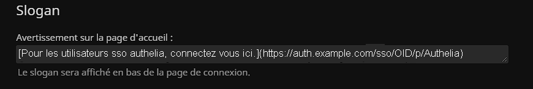

# Jellyfin avec Authelia

Mise à jour de la documentation officielle qui ne fonctionne pas pour une correction opérationnelle.

## Table des matières

- [Installation](#installation)
- [Configuration](#configuration)
- [Contribuer](#contribuer)

## Installation

1. Connectez-vous au tableau de bord d'administration de Jellyfin.
2. Allez dans "Plugins".
3. Allez dans "Repositories".
4. Ajoutez un référentiel :
   - Nom du référentiel : Jellyfin SSO
   - URL du référentiel : https://raw.githubusercontent.com/9p4/jellyfin-plugin-sso/manifest-release/manifest.json
5. Cliquez sur "Save".
6. Cliquez sur "OK" pour confirmer l'ajout du référentiel.
7. Allez dans "Catalog".
8. Sélectionnez "SSO Authentication" dans "Authentication".
9. Cliquez sur "Installer".
10. Cliquez sur "OK" pour confirmer l'installation du plugin.
11. Une fois installé, redémarrez Jellyfin.

## Configuration

N'oubliez pas d'ajouter les utilisateurs autorisés à accéder à Jellyfin dans le groupe "jellyfin-users" tel que spécifié dans le fichier user_database.yml.

Pour ajouter un lien cliquable redirigeant vers Authelia, sinon utilisez l'URL suivante : `https://jellyfin.example.com/sso/OID/p/Authelia`.

## Contribuer

- Auconnors
